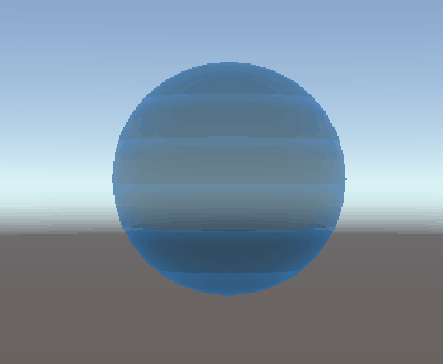
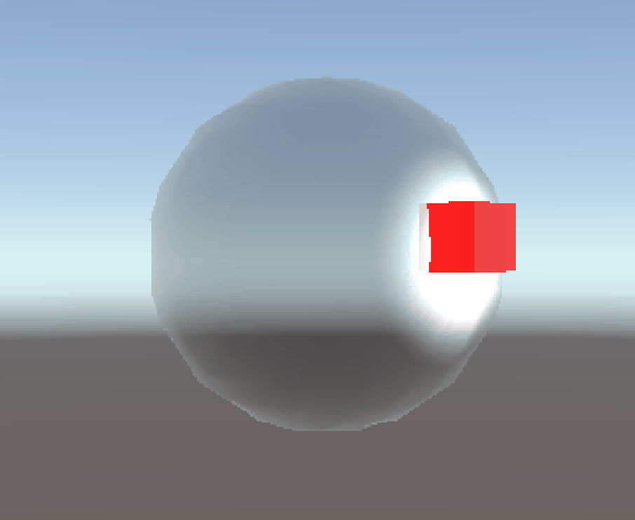
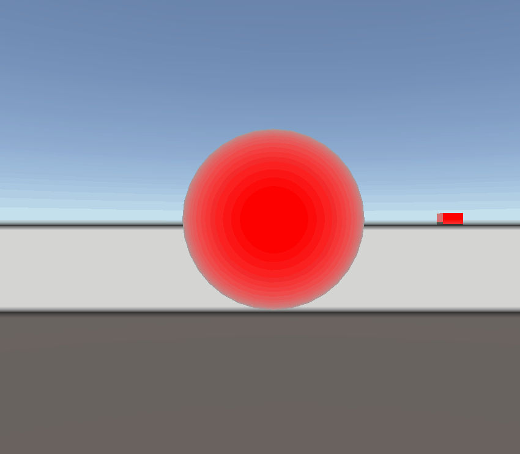
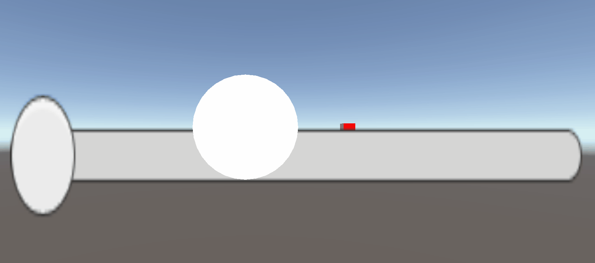
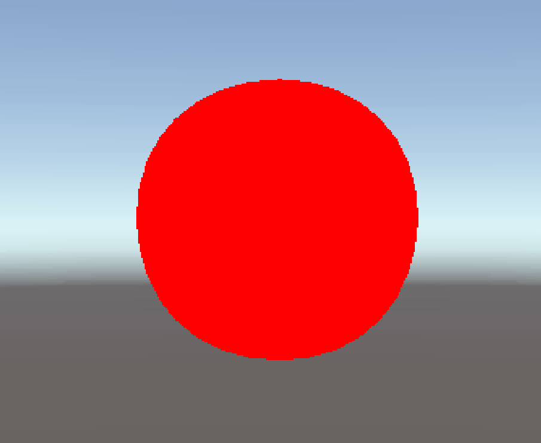
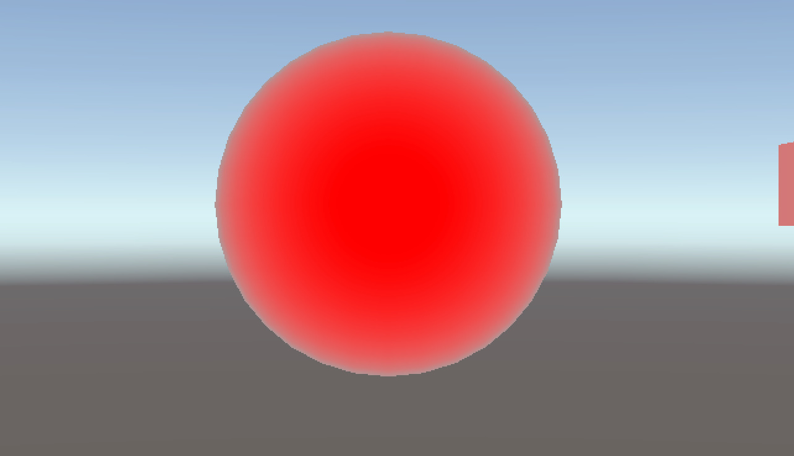

# TA 技术作品集 (Technical Art Portfolio)

> **核心方向：** Shader 视觉效果 | URP 渲染管线 | 实时交互特效
> **联系方式：** vile4746@gmail.com

---

## 🎨 效果展示

### 1. 全息投影扫描 (Holographic Scan)
- **技术点：** 顶点波浪 | 扫描线脉冲 (Frac + Smoothstep) | 半透明混合 | 边缘光 Fresnel
- **交互：** 扫描速度、颜色、透明度

### 2. 力场护盾 (Force Shield)
- **技术点：** 三层叠加渲染 (菲涅尔 + 网格纹理 + 相交高亮)
- **协作亮点：** C# 物理碰撞检测 (ClosestPoint) 驱动 Shader 实时发光
- **交互：** 护盾强度、相交光晕颜色/范围

### 3. 深度边缘检测 (Sobel Edge Detection)
- **技术点：** 全屏后处理 | Sobel 算子 | 深度纹理采样 | URP Renderer Feature
- **交互：** 边缘线粗细、颜色、深度阈值

### 4. 燃烧溶解 (Dissolve)
- **技术点：** 噪声纹理采样 | Alpha Clip 丢弃 | 边缘发光
- **交互：** 溶解进度、边缘宽度、燃烧颜色

### 5. 动态顶点波浪 (Vertex Wave)
- **技术点：** 顶点着色器正弦波位移 | 法线重计算
- **交互：** 波高、频率、波长

### 6. 边缘光特效 (Fresnel Rim Light)
- **技术点：** 法线·视线点积 | Pow 衰减控制 | 多色渐变叠加
- **交互：** 强度、指数、内外颜色

---

## 🧠 底层理解：自研软渲染器 (Java)

> 为深入理解 GPU 渲染管线原理，用 Java 从零实现了一个实时光栅化渲染器。
> **仓库地址：** [你的软渲染器仓库链接]

- **几何阶段：** 顶点变换 (Model → World → View → Clip) 、透视除法、视口映射
- **光栅化：** 重心坐标插值、深度测试 (Z-Buffer)、背面剔除
- **着色：** Blinn-Phong 光照模型、纹理采样与双线性过滤
- **关键攻克：** 深刻理解了透视校正插值 (1/w 插值) 的数学原理，解决了纹理在透视下的扭曲问题

> *注：为了验证图形学基础，放弃JNI技术封装win32库。使用 OpenGL/DirectX 等图形 API，仅依赖 Java 2D 做逐像素绘制。*
---

## 🛠 技术栈

| 类别 | 掌握情况 |
|------|---------|
| **渲染管线** | URP 深度纹理机制、Frame Debugger 调试 |
| **Shader 编写** | HLSL 顶点/片段着色器、多 Pass 叠加、后处理 |
| **C# 脚本** | 物理碰撞检测与 Shader 传参 (SetVector/SetFloat) |
| **编辑器与工具** | 自定义 Slider 实时控制、GitHub 版本管理 |

---

## 📝 排坑日志 (Debugging Log)

- **URP 深度纹理不稳定：** 通过 Frame Debugger 定位到 CopyDepth 与 DepthPrepass 机制冲突，确认了任何在 `BeforeRenderingOpaques` 请求深度的 Feature 都会导致复制中断。
- **球面网格纹理替代：** 放弃在 Shader 内程序生成多边形纹理，改用外部贴图方案，解决了球面均匀网格难以映射的问题。
- **相交高亮方案迭代：** 深度比较法受深度缓冲限制存在误触发，最终改用 `Collider.ClosestPoint` 结合 `SetVector` 传给 Shader 计算距离，实现了稳定可控的发光逻辑。
- **GPU 架构认知：** 深刻理解了 GPU 无动态内存分配、SIMD 并行下的分支发散问题，优先用数学函数 (Smoothstep/Lerp) 替代 if 分支。

---

## 🔮 下一步规划

- 编辑器工具开发（自定义 Inspector、ScriptableObject 配置）
- 动画系统与 Shader 的联动优化
- 更多顶点动画效果探索（模型爆炸、风格化变形）

---

*本作品集为求职期间持续更新的活文档，欢迎通过邮件交流技术细节。*
